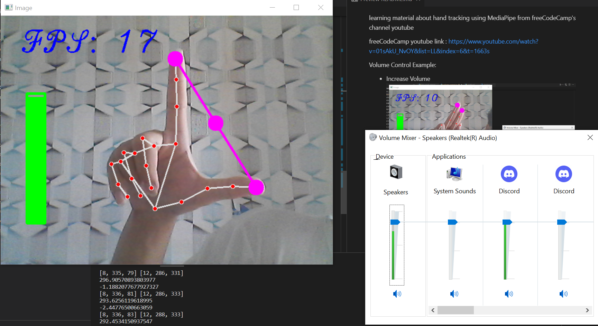
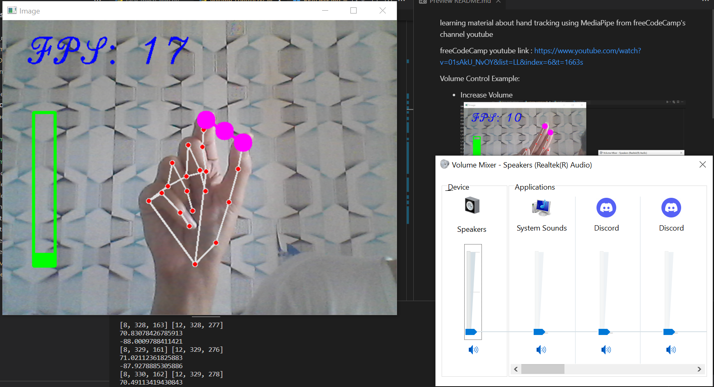
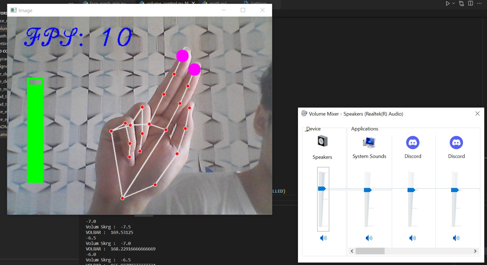
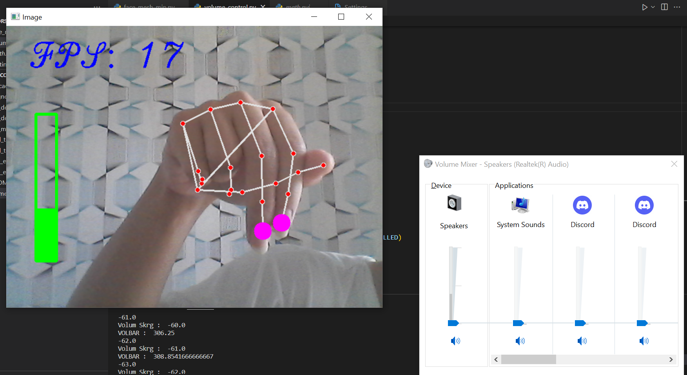
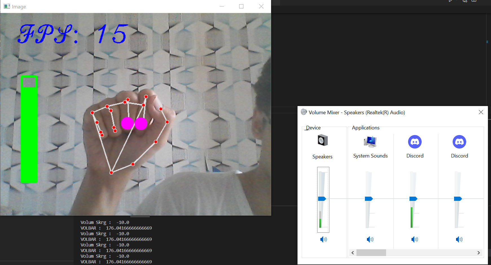

learning material about hand tracking using MediaPipe from [freeCodeCamp's channel youtube](https://www.youtube.com/watch?v=01sAkU_NvOY&list=LL&index=6&t=1663s)

Volume Control freeCodeCamp Example: 

* Increase Volume

* Decrease Volume

Another Volume Control Renewal:

* Increase Volume

* Decrease Volume

* Stay Volume
